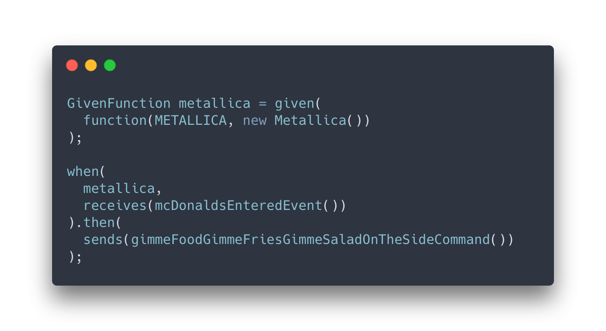

# statefun-tsukuyomi



Statefun Tsukuyomi is a library for Java that enables narrowed integration testing of Flink Stateful Functions applications.

## What does Tsukuyomi mean?

Since you're observing this repo, you probably know what's Statefun. But what is Tsukuyomi? I borrowed the word from the fantastic world of "Naruto" where Tsukuyomi means a
powerful ninja technique. It traps the opponent into an illusion that the opponent cannot identify.

This project does the same with the function under test — it puts the function into the fake environment with egresses and
other functions. Those fake components capture function state and messages to provide the developer with a clean and
nice verification API.

## Features
### BDD-style DSL
```java
GivenFunction testee = given(
    // Define your function under test        
);

when(
    // Define interaction with the function
).then(
    // Verify your expectations
);
```
### Initial state
```java
GivenFunction testee = given(
    function(Testee.TYPE, new Testee()),
    withState(Testee.FOO, empty()),
    withState(Testee.BAR, havingValue(BAR))
);
```
### Verification of outgoing messages
```java
then(
    sendsInOrder(expectedToFunction),
    sendsInOrder(expectedToEgress),
    sends(expectedToSelf)
);
```
### Verification of message order
Statefun Tsukuyomi supports verification of outgoing messages in two modes: **in order** and **in any order**. 
In any order mode verifies whether the function under test sends the message. In order mode verifies 
that the function sends the message in a particular order.
```java
then(
    // Verifies that function sends this message first.
    sendsInOrder(expectedToFunction),
    // Verifies that the function sends this message in any order.
    sends(expectedToEgress),
    // Verifies that the function sends this message in any order.
    sends(expectedToEgress),
    // Verifies that the function sends this message last.
    sendsInOrder(expectedToFunction),
);
```
### Verification of state after interaction
```java
.then(
    state(Testee.FOO, is("foo")) // Hamcrest matchers supported
);
```
## Installation
## Add repository
```xml
<repository>
  <id>statefun-tsukuyomi</id>
  <url>https://maven.pkg.github.com/f1xmAn/statefun-tsukuyomi</url>
</repository>
```
### Add dependency

```xml

<dependency>
    <groupId>com.github.insyde.statefun.tsukuyomi</groupId>
    <artifactId>statefun-tsukuyomi</artifactId>
    <version>v0.1.0</version>
</dependency>
```
## Usage

### Have your function under test

```java
static class Testee implements StatefulFunction {

    static TypeName TYPE = TypeName.typeNameFromString("foo/testee");
    static ValueSpec<String> FOO = ValueSpec.named("foo").withUtf8StringType();
    static ValueSpec<String> BAR = ValueSpec.named("bar").withUtf8StringType();

    @Override
    public CompletableFuture<Void> apply(Context context, Message message) {
        AddressScopedStorage storage = context.storage();
        String bar = storage.get(BAR).orElse("");
        storage.set(FOO, "foo");
        String value = message.asUtf8String() + bar;
        Message toFunction = MessageBuilder.forAddress(COLLABORATOR_2, context.self().id())
                .withValue(value)
                .build();
        context.send(toFunction);
        Message toSelf = MessageBuilder.forAddress(context.self())
                .withValue(value)
                .build();
        context.send(toSelf);
        EgressMessage toEgress = EgressMessageBuilder.forEgress(EGRESS)
                .withValue(value)
                .build();
        context.send(toEgress);
        context.sendAfter(Duration.ofSeconds(1), toFunction);
        return context.done();
    }
}
```

### Create envelopes
Envelope is an object that describes a Message. Envelope has three main parts:
#### From (Optional)
Who sends this message. Do not set if message sender is an ingress.
#### To (Mandatory)
Who receives this message. Destination can be either function or egress.
#### Data (Mandatory)
A message content.
```java
private Envelope outgoingEnvelopeToEgress() {
    return Envelope.builder()
        .toEgress(EGRESS)
        .data(Types.stringType(), HELLO + BAR)
        .build();
}

private Envelope outgoingEnvelopeToFunction() {
    return Envelope.builder()
        .from(Testee.TYPE, FUNCTION_ID)
        .toFunction(COLLABORATOR_2, FUNCTION_ID)
        .data(Types.stringType(), HELLO + BAR)
        .build();
}

private Envelope delayedEnvelopeToFunction() {
    return Envelope.builder()
        .from(Testee.TYPE, FUNCTION_ID)
        .toFunction(COLLABORATOR_2, FUNCTION_ID)
        .data(Types.stringType(), HELLO + BAR)
        .delay(Duration.ofHours(1))
        .build();
}

private Envelope outgoingEnvelopeToSelf() {
    return Envelope.builder()
        .from(Testee.TYPE, FUNCTION_ID)
        .toFunction(Testee.TYPE, FUNCTION_ID)
        .data(Types.stringType(), HELLO + BAR)
        .build();
}

private Envelope incomingEnvelope() {
    return Envelope.builder()
        .from(COLLABORATOR_1, FUNCTION_ID)
        .toFunction(Testee.TYPE, FUNCTION_ID)
        .data(Types.stringType(), HELLO)
        .build();
}
```

### Run test

```java
@Test
@Timeout(30)
void verifiesThatTheFunctionSendsMessagesInOrderTheyExpected() {
    // Define your envelopes
    Envelope envelope = incomingEnvelope();
    Envelope expectedToFunction = outgoingEnvelopeToFunction();
    Envelope expectedToEgress = outgoingEnvelopeToEgress();
    Envelope expectedToSelf = outgoingEnvelopeToSelf();
    Envelope expectedToFunctionDelayed = delayedEnvelopeToFunction();
    // Define function under test and its initial state
    GivenFunction testee = given(
        function(Testee.TYPE, new Testee()),
        withState(Testee.FOO, empty()),
        withState(Testee.BAR, havingValue(BAR))
    );

    // When function under test receives that envelope
    when(
        testee,
        receives(envelope)
    ).then(
        // Then expect it sends the following messages
        sendsInOrder(expectedToFunction),
        sendsInOrder(expectedToSelf),
        sendsInOrder(expectedToEgress),
        sendsInOrder(expectedToFunctionDelayed),
        // and has the following state value after invocation
        state(Testee.FOO, is("foo"))
    );
}
```
